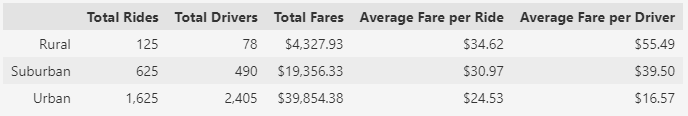
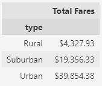
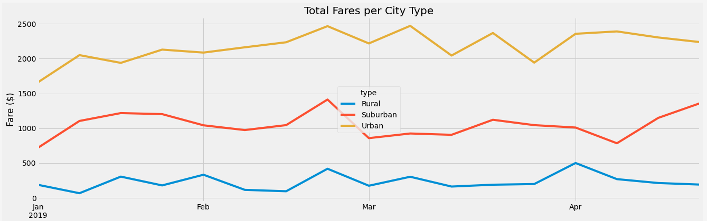

# PyBer_Analysis
An analysis of ride sharing data

## Overview of the analysis: Explain the purpose of the new analysis.
The point of this analysis is to create a summary of the data from a ride-sharing dataset for the company "Pyber". Specifically this analysis will be focused on information by city type (Urban, Suburban, and Rural). This summary will include a DataFrame of ride-sharing data by city type, a chart describing income per week by city type, and some business recommendations for addressing disparities among the different city types.
 

## Results: 

The results of the analysis by city type show about what one would expect when you consider the population density differences between the three types. Rural cities have lower densities and more people would use and have their own cars, while many in urban areas live without cars and need ride shares to supplement their alternative methods of transportation.

##### **Summary of city type data**

 

Above we can see there are major differences between the city types urban and rural with suburban in between; this is what we should expect considering the population density differences mentioned above. To summarize the major differences:

 

*  Urban cities have the most total rides, drivers, and fares
*  Urban cities have the lowest average fares
*  Rural cities are the opposite in all metrics to urban cities
*  Suburban is somewhere between the two on all metrics
  
 

Another interesting point in the data is the fact there are more drivers than total rides in Urban cities. Of course total rides above only covers Jan-Jun 2019 and more drivers would have signed on in the past who are either inactive now or not trying/needing to. 

By visualizing the total fares over time, we can see that there is a very even difference between the total fare amount cities within a certain type collect on a typical day:
<!-- 
##### **Total fares by city type**
 -->

##### **Total fares per city type over time**

 

It appears that despite lower average fares in urban areas, the sheer volume of them consistently gives us the highest returns.

 

## Summary: 
Below are three business recommendations I would make considering the data above:

**1.** Urban drivers make much less average fare than rural drivers, meaning they have to drive more in order to make the same as a rural driver. This could be addressed by giving a bonus for a certain quantity of rides over a work period. This may be worth considering if employee turnover rates are high or become high in the future, as well as for the reputation/consumer perception of the company.

**2.** Because of the increased fare costs in rural and suburban areas, some customers may be more hesitant to try Pyber services or incorporate them into their normal routine.  While lowering the fares all the time may not be the best option, we could introduce promotions or other temporary discounts and increase rural revenue in the future.

**3.** Lastly, with the surplus of drivers in urban areas, there is a chance that some drivers would work more if possible. Incentives could be provided for drivers from urban areas to go to suburban and possibly rural areas for increased rates or covered extra gas costs. During days where rider surges are expected this could lead to overall greater profits.
